# 源码分析

## 文件结构

``` bash
├── index.d.ts - 声明文件
├── index.js - 入口文件，暴露egg.js,egg_loader.js,base_context_class.js和utils.js
├── lib
|  ├── egg.js - 继承自koa，在其基础上挂载了很多egg内建的对象和逻辑。
|  ├── lifecycle.js - 提供生命周期钩子函数，执行时逐个运行注册在不同生命周期阶段的函数列表
|  ├── loader
|  |  ├── context_loader.js - 加载内容到到 ctx，只有get，懒加载
|  |  ├── egg_loader.js - 包含context_loader,file_loader和mixin下各个挂载方法的loader对象。
|  |  ├── file_loader.js - 加载一个目录下的文件到 app，比如 app/controller/home.js 会加载到 app.controller.home
|  |  └── mixin
|  |     ├── config.js - 提供loadConfig方法，根据规约获取配置参数，挂载在egg_loader.js的原型上，提供给继承者egg.js中的agent_worker_loader.js和app_worker_loader.js
|  |     ├── controller.js - 将app/controller文件夹下文件通过loadToApp加到app.controller上
|  |     ├── custom.js - 自定义app和agent的加载，提供loadCustomApp方法供继承者egg.js中去调用。增加生命周期钩子和执行。
|  |     ├── custom_loader.js - 提供loadCustomLoader方法，处理自定义loader，针对app和ctx通过loadToApp和loadToContext来注入
|  |     ├── extend.js - 提供loadAgentExtend，loadContextExtend等多个方法，获取extend文件夹下扩展内容，给对应Egg原型上对象进行扩展
|  |     ├── middleware.js - 提供loadMiddleware，将app/middleware文件夹下middlewares加到app，应用层定义中间件appMiddleware和框架默认中间件coreMiddleware进行合并，最后遍历app.use
|  |     ├── plugin.js - 提供loadPlugin方法，根据规约获取插件配置，挂载在egg_loader.js的原型上，提供给继承者egg.js中的agent_worker_loader.js和app_worker_loader.js
|  |     ├── router.js - 提供loadRouter，加载app/router.js
|  |     └── service.js - 提供loadService方法，通过loadToContext将service注入到ctx上
|  └── utils
|     ├── base_context_class.js - 简单组装一些参数到this上，如ctx.app,ctx.app.config,ctx.service
|     ├── index.js
|     ├── sequencify.js
|     └── timing.js - 计时器对象
```

## 外部模块依赖

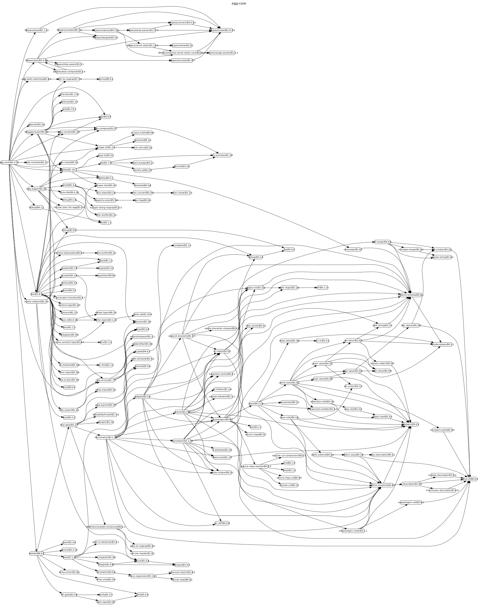

## 内部模块依赖

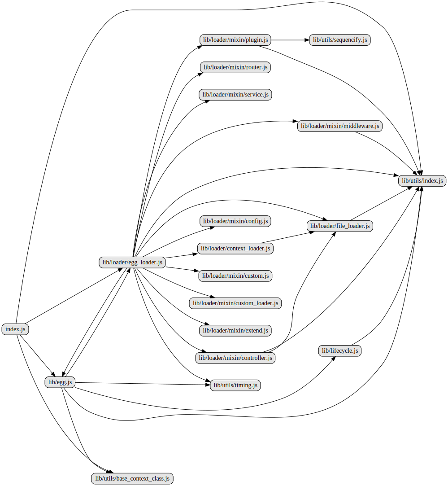

## 各文件解析

### index.js

入口文件，暴露egg.js,egg_loader.js,base_context_class.js和utils.js

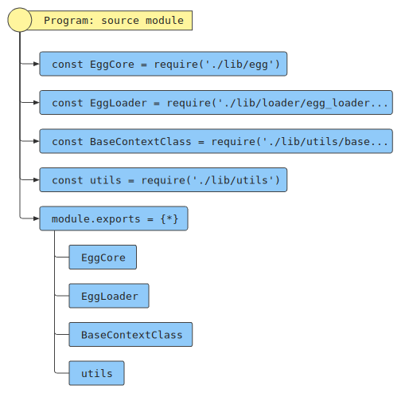

### lib/egg.js

继承自koa，在其基础上挂载了很多egg内建的对象和逻辑。

基于egg-logger的EggConsoleLogger挂载了this.console。基于base_context_class.js挂载this.Controller和this.Service。基于lifecycle.js挂载this.lifecycle。基于egg_loader.js挂载this.loader。基于@eggjs/route模块EggRouter来初始化路由。

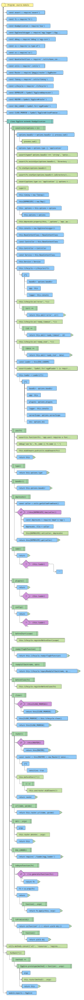


### lib/util/timing.js

计时器对象

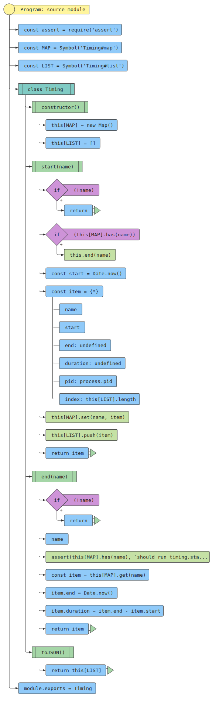


### lib/util/base_context_class.js

简单组装一些参数到this上，如ctx.app,ctx.app.config,ctx.service

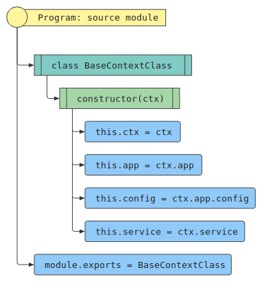


### lib/lifecycle.js

提供生命周期钩子函数，执行时逐个运行注册在不同生命周期阶段的函数列表

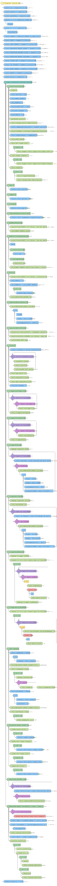

### lib/loader/egg_loader.js

包含context_loader,file_loader和mixin下各个挂载方法的loader对象

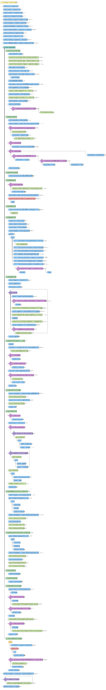


### lib/loader/file_loader.js

加载一个目录下的文件到 app，比如 app/controller/home.js 会加载到 app.controller.home


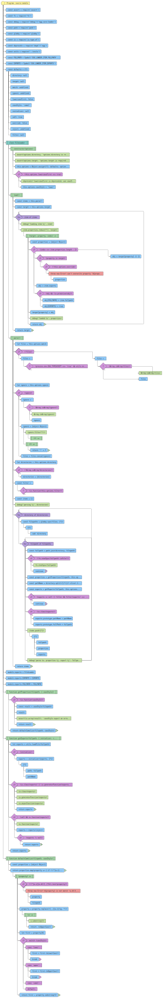

### lib/loader/context_loader.js

加载内容到到 ctx，只有get，懒加载。


### lib/loader/mixin/pulgin.js

提供loadPlugin方法，根据规约获取插件配置，挂载在egg_loader.js的原型上，提供给继承者egg.js中的agent_worker_loader.js和app_worker_loader.js

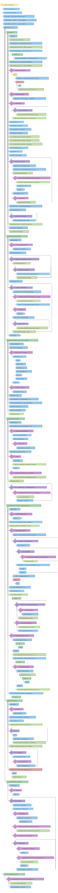

### lib/loader/mixin/config.js

提供loadConfig方法，根据规约获取配置参数，挂载在egg_loader.js的原型上，提供给继承者egg.js中的agent_worker_loader.js和app_worker_loader.js

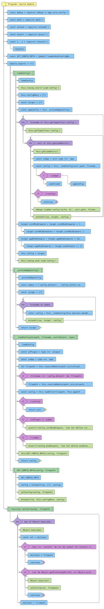

### lib/loader/mixin/extend.js

提供loadAgentExtend，loadContextExtend等多个方法，获取extend文件夹下扩展内容，给对应Egg原型上对象进行扩展

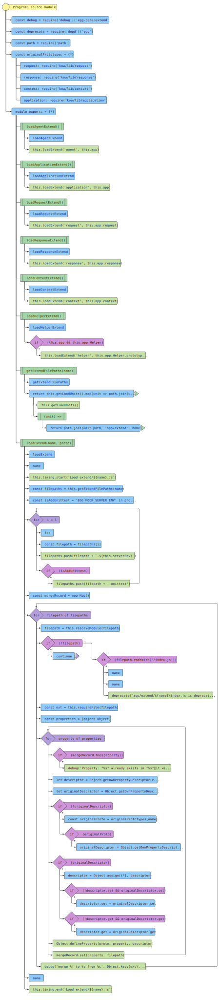

### lib/loader/mixin/custom.js

自定义app和agent的加载，提供loadCustomApp方法供继承者egg.js中去调用。增加生命周期钩子和执行。

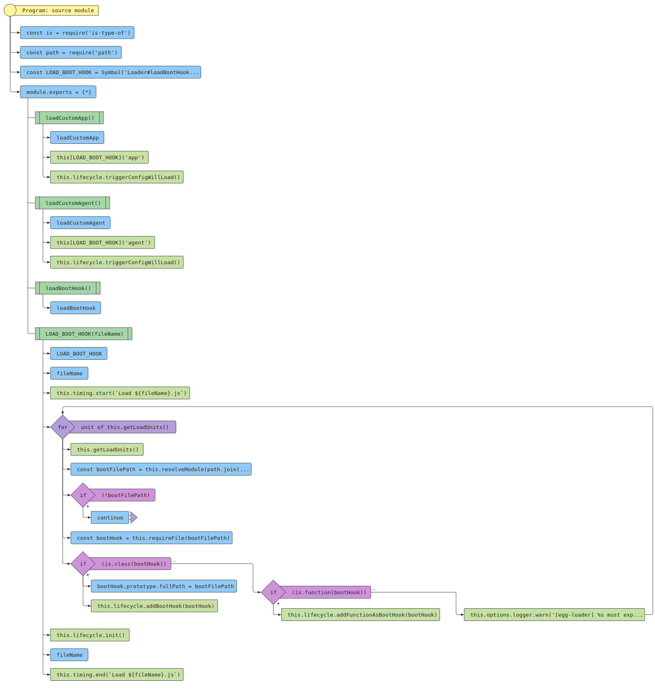

### lib/loader/mixin/service.js

提供loadService方法，通过loadToContext将service注入到ctx上。

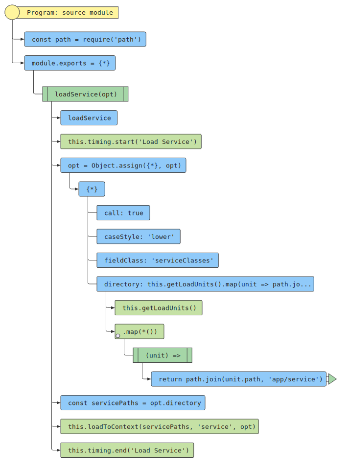

### lib/loader/mixin/middleware.js

提供loadMiddleware，将app/middleware文件夹下middlewares加到app，应用层定义中间件appMiddleware和框架默认中间件coreMiddleware进行合并，最后遍历app.use


### lib/loader/mixin/controller.js

将app/controller文件夹下文件通过loadToApp加到app.controller上

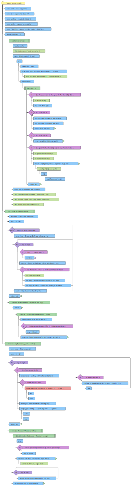

### lib/loader/mixin/router.js

加载app/router.js

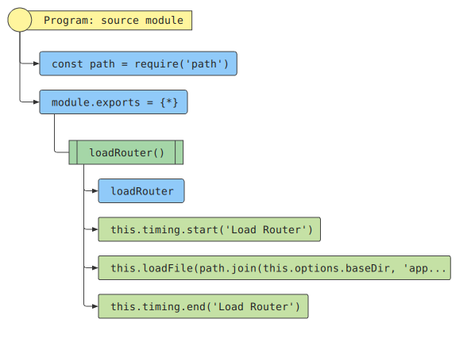


### lib/loader/mixin/custom_loader.js

提供loadCustomLoader方法，处理自定义loader，针对app和ctx通过loadToApp和loadToContext来注入。

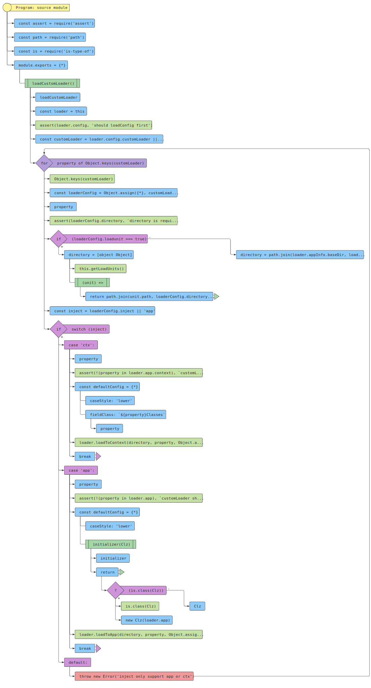


